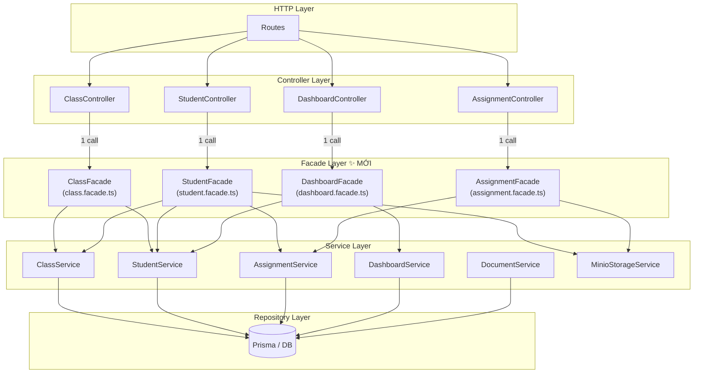

# 🏛️ Facade Pattern trong Backend — WebsiteClassroom_KT

## 1. Facade Pattern là gì?

> [!NOTE]
> **Facade** cung cấp một **giao diện đơn giản, thống nhất** che giấu sự phức tạp của nhiều subsystem (services) bên trong. Controller không cần biết phối hợp bao nhiêu service — chỉ gọi một method duy nhất từ Facade.

```
TRƯỚC (không có Facade):
Controller → ClassService
Controller → StudentService   ← Controller tự phối hợp nhiều service
Controller → DashboardService
Controller → AssignmentService

SAU (có Facade):
Controller → ClassFacade → ClassService
                         → StudentService   ← Facade phối hợp
                         → AssignmentService
```

---

## 2. Vấn đề hiện tại trong project

### `studentController.ts` — controller đang gọi 2 service cùng lúc ❌
```typescript
// studentController.ts
import * as ClassService   from "../services/class.service.js";   // ← service 1
import * as StudentService from "../services/student.service.js"; // ← service 2

// joinClass gọi ClassService trực tiếp
const targetClass = await ClassService.joinClass(studentId, joinCode);

// submitAssignment tự khởi tạo MinioStorageService bên trong Controller ❌
const storageService = new MinioStorageService("classroom-submissions");
const result = await storageService.uploadFile(file.buffer, ...);
const submission = await StudentService.submitEssayAssignment(...);
```

### `assignmentController.ts` — controller truy cập thẳng repo ❌
```typescript
// Controller vi phạm separation of concerns khi truy cập private repo
const assignment = await assignmentService["assignmentRepo"].findAssignmentById(assignmentId);
```

**Hậu quả:**
- Controller quá "béo" — biết quá nhiều về internal
- Logic phối hợp (orchestration) rải rác khắp controllers
- Khó test: phải mock nhiều service trong 1 test
- Khi đổi business logic → phải sửa controller

---

## 3. Sơ đồ cây project **HIỆN TẠI**

```
backend_kientruc/src/
│
├── config/
│   └── prisma.ts
├── infrastructure/
│   └── redisClient.ts
├── errors/
│   ├── AppError.ts
│   └── index.ts
├── utils/
│   ├── logger.ts
│   └── jwt.ts
│
├── middlewares/
│   ├── authMiddleware.ts
│   ├── classMiddleware.ts
│   ├── roleMiddleware.ts
│   ├── uploadMiddleware.ts
│   ├── validate.ts
│   ├── errorHandler.ts
│   └── notFoundHandler.ts
│
├── repositories/
│   ├── user.repo.ts
│   ├── session.repo.ts
│   ├── class.repo.ts
│   ├── student.repo.ts
│   ├── assignment.repo.ts
│   ├── document.repo.ts
│   └── dashboard.repo.ts
│
├── services/
│   ├── auth.service.ts
│   ├── user.service.ts
│   ├── class.service.ts
│   ├── student.service.ts
│   ├── assignment.service.ts
│   ├── document.service.ts
│   ├── dashboard.service.ts
│   ├── storage/
│   │   └── minioStorage.ts
│   ├── email/
│   │   ├── emailProvider.ts
│   │   └── nodemailerProvider.ts
│   └── token/
│       ├── token.strategy.ts
│       └── hash.strategy.ts
│
├── controllers/           ← GỌI TRỰC TIẾP NHIỀU SERVICE (vấn đề)
│   ├── authController.ts
│   ├── userController.ts
│   ├── classController.ts
│   ├── studentController.ts
│   ├── assignmentController.ts
│   ├── documentController.ts
│   └── dashboardController.ts
│
├── routes/
│   ├── authRoutes.ts
│   ├── userRoutes.ts
│   ├── classRoutes.ts
│   ├── studentRoutes.ts
│   ├── assigmentRoutes.ts
│   ├── documentRoutes.ts
│   └── dashboardRoutes.ts
│
├── events/
│   └── eventBus.ts
├── subscribers/
│   └── assignmentSubscriber.ts
└── index.ts
```

---

## 4. Sơ đồ cây project **SAU KHI** áp dụng Facade

```
backend_kientruc/src/
│
├── config/
│   └── prisma.ts
├── infrastructure/
│   └── redisClient.ts
├── errors/
│   ├── AppError.ts
│   └── index.ts
├── utils/
│   ├── logger.ts
│   └── jwt.ts
│
├── middlewares/
│   ├── authMiddleware.ts
│   ├── classMiddleware.ts
│   ├── roleMiddleware.ts
│   ├── uploadMiddleware.ts
│   ├── validate.ts
│   ├── errorHandler.ts
│   └── notFoundHandler.ts
│
├── repositories/          (không đổi)
│   ├── user.repo.ts
│   ├── session.repo.ts
│   ├── class.repo.ts
│   ├── student.repo.ts
│   ├── assignment.repo.ts
│   ├── document.repo.ts
│   └── dashboard.repo.ts
│
├── services/              (không đổi — thuần business logic)
│   ├── auth.service.ts
│   ├── user.service.ts
│   ├── class.service.ts
│   ├── student.service.ts
│   ├── assignment.service.ts
│   ├── document.service.ts
│   ├── dashboard.service.ts
│   ├── storage/
│   │   └── minioStorage.ts
│   ├── email/
│   │   ├── emailProvider.ts
│   │   └── nodemailerProvider.ts
│   └── token/
│       ├── token.strategy.ts
│       └── hash.strategy.ts
│
├── facades/               ← MỚI ✨ — phối hợp nhiều services
│   ├── class.facade.ts    # Quản lý lớp học (teacher view)
│   ├── student.facade.ts  # Toàn bộ luồng học sinh
│   ├── assignment.facade.ts # Bài tập + nộp bài + chấm điểm
│   ├── document.facade.ts # Upload + xem tài liệu
│   └── dashboard.facade.ts  # Tổng hợp dữ liệu dashboard
│
├── controllers/           ← GỌI DUY NHẤT 1 FACADE (gọn gàng)
│   ├── authController.ts
│   ├── userController.ts
│   ├── classController.ts
│   ├── studentController.ts
│   ├── assignmentController.ts
│   ├── documentController.ts
│   └── dashboardController.ts
│
├── routes/                (không đổi)
│   ├── authRoutes.ts
│   ├── userRoutes.ts
│   ├── classRoutes.ts
│   ├── studentRoutes.ts
│   ├── assigmentRoutes.ts
│   ├── documentRoutes.ts
│   └── dashboardRoutes.ts
│
├── events/
│   └── eventBus.ts
├── subscribers/
│   └── assignmentSubscriber.ts
└── index.ts
```

---

## 5. Sơ đồ luồng kiến trúc với Facade



---

## 6. Code mẫu — `facades/student.facade.ts`

Đây là ví dụ phức tạp nhất: `StudentController` hiện đang tự phối hợp `ClassService`, `StudentService`, và `MinioStorageService`.

```typescript
// src/facades/student.facade.ts

import { ClassService }              from "../services/class.service.js";
import { StudentService }            from "../services/student.service.js";
import { IStorageService }           from "../services/storage/minioStorage.js";
import { BadRequestError }           from "../errors/index.js";

export interface SubmitEssayInput {
  files: Express.Multer.File[];
}

/**
 * StudentFacade — giao diện đơn giản cho toàn bộ luồng Học Sinh.
 * Controller chỉ cần gọi facade, không cần biết bên trong dùng service nào.
 */
export class StudentFacade {
  constructor(
    private readonly classService:   ClassService,
    private readonly studentService: StudentService,
    private readonly storageService: IStorageService,
  ) {}

  /** Học sinh tham gia lớp bằng mã joinCode */
  async joinClass(studentId: string, joinCode: string) {
    if (!joinCode) throw new BadRequestError("Vui lòng cung cấp mã tham gia (joinCode).");
    return this.classService.joinClass(studentId, joinCode);
  }

  /** Lấy danh sách lớp học đã tham gia */
  async getEnrolledClasses(studentId: string, search?: string) {
    return this.classService.getJoinedClassesByStudentId(studentId, search);
  }

  /** Lấy chi tiết lớp học (từ góc nhìn học sinh) */
  async getClassDetails(studentId: string, classId: string) {
    return this.studentService.getClassDetailsForStudent(studentId, classId);
  }

  /** Nộp bài tự luận: upload file → lưu submission */
  async submitEssayAssignment(
    studentId: string,
    assignmentId: string,
    input: SubmitEssayInput,
  ) {
    const attachments: { fileName: string; fileUri: string; fileSize: number }[] = [];

    // Upload tất cả file lên MinIO — logic này vốn nằm trong Controller
    for (const file of input.files ?? []) {
      const result = await this.storageService.uploadFile(
        file.buffer,
        file.originalname,
        file.mimetype,
      );
      attachments.push({
        fileName: file.originalname,
        fileUri:  result.url,
        fileSize: result.size,
      });
    }

    return this.studentService.submitEssayAssignment(studentId, assignmentId, attachments);
  }

  /** Nộp bài trắc nghiệm */
  async submitQuizAssignment(
    studentId: string,
    assignmentId: string,
    answers: { questionId: string; selectedOptionId: string }[],
  ) {
    if (!Array.isArray(answers) || answers.length === 0)
      throw new BadRequestError("Danh sách câu trả lời không hợp lệ.");
    return this.studentService.submitQuizAssignment(studentId, assignmentId, answers);
  }

  /** Xem bài nộp + điểm */
  async getSubmissionAndGrade(studentId: string, assignmentId: string) {
    return this.studentService.getSubmissionAndGrade(studentId, assignmentId);
  }

  /** Dashboard của học sinh */
  async getDashboard(studentId: string) {
    return this.studentService.getStudentDashboard(studentId);
  }

  /** Điểm của học sinh trong lớp */
  async getGrades(studentId: string, classId: string) {
    return this.studentService.getGradesForStudent(studentId, classId);
  }
}
```

---

## 7. Code mẫu — `facades/assignment.facade.ts`

```typescript
// src/facades/assignment.facade.ts

import { AssignmentService }   from "../services/assignment.service.js";
import { IStorageService }     from "../services/storage/minioStorage.js";
import { BadRequestError }     from "../errors/index.js";

export class AssignmentFacade {
  constructor(
    private readonly assignmentService: AssignmentService,
    private readonly storageService:    IStorageService,
  ) {}

  async getAssignments(teacherId: string, classId: string) {
    return this.assignmentService.getAssignmentsByClassId(teacherId, classId);
  }

  async getAssignmentDetail(teacherId: string, assignmentId: string) {
    return this.assignmentService.getAssignmentById(teacherId, assignmentId);
  }

  async createAssignment(teacherId: string, classId: string, body: any) {
    return this.assignmentService.createAssignment(teacherId, classId, body);
  }

  async updateAssignment(teacherId: string, assignmentId: string, body: any) {
    return this.assignmentService.updateAssignment(teacherId, assignmentId, body);
  }

  async deleteAssignment(teacherId: string, assignmentId: string) {
    return this.assignmentService.deleteAssignment(teacherId, assignmentId);
  }

  /**
   * Chấm điểm bài nộp — Facade kiểm tra loại bài TẠI ĐÂY thay vì trong Controller
   * (trước đây Controller phải truy cập trực tiếp assignmentService["assignmentRepo"])
   */
  async gradeSubmission(
    teacherId: string,
    assignmentId: string,
    submissionId: string,
    payload: { score: number; comment?: string },
  ) {
    // Kiểm tra loại bài — logic này thuộc về Facade, không phải Controller
    const assignment = await this.assignmentService.findAssignmentById(assignmentId);
    if (assignment?.typeAssignment === "MULTIPLE_CHOICE") {
      throw new BadRequestError("Bài trắc nghiệm được chấm điểm tự động, không thể chấm thủ công.");
    }
    return this.assignmentService.gradeSubmission(teacherId, assignmentId, submissionId, payload);
  }
}
```

---

## 8. Controller gọn gàng sau khi có Facade

```typescript
// src/controllers/studentController.ts — SAU KHI dùng Facade ✅

import { Request, Response, NextFunction } from "express";
import { StudentFacade } from "../facades/student.facade.js";
import { UnauthorizedError, ForbiddenError } from "../errors/index.js";

export class StudentController {
  constructor(private readonly facade: StudentFacade) {}

  async joinClass(req: Request, res: Response, next: NextFunction) {
    try {
      const studentId = this.ensureStudent(req);
      const result = await this.facade.joinClass(studentId, req.body.joinCode);
      res.status(200).json({ success: true, message: "Tham gia lớp học thành công!", data: result });
    } catch (error) { next(error); }
  }

  async submitEssayAssignment(req: Request, res: Response, next: NextFunction) {
    try {
      const studentId = this.ensureStudent(req);
      const result = await this.facade.submitEssayAssignment(
        studentId,
        req.params.assignmentId,
        { files: req.files as Express.Multer.File[] },
      );
      res.status(201).json({ success: true, message: "Nộp bài thành công!", data: result });
    } catch (error) { next(error); }
  }

  private ensureStudent(req: Request): string {
    const user = (req as any).user;
    if (!user?.userId) throw new UnauthorizedError("Vui lòng đăng nhập.");
    if (user.role !== "student") throw new ForbiddenError("Chỉ Học sinh mới được phép.");
    return user.userId;
  }
}
```

---

## 9. So sánh trước & sau

| Tiêu chí | Trước (không Facade) | Sau (có Facade) |
|----------|---------------------|-----------------|
| **Controller** | Gọi 2-3 service + tự khởi tạo MinIO | Gọi đúng 1 Facade method |
| **Orchestration** | Rải rác trong Controller | Tập trung trong Facade |
| **Business logic** | Một phần nằm trong Controller | Hoàn toàn trong Facade/Service |
| **Testing Controller** | Mock 2-3 service | Mock 1 Facade |
| **Testing Facade** | N/A | Mock từng Service riêng biệt |
| **Đổi storage provider** | Sửa trong Controller | Sửa trong Facade constructor |
| **Đọc Controller code** | Phức tạp | Rõ ràng như "use case list" |

> [!TIP]
> Mỗi **Facade = 1 nhóm use case** của ứng dụng.
> - `StudentFacade` → mọi thứ học sinh làm
> - `ClassFacade` → mọi thứ giáo viên làm với lớp học
> - `AssignmentFacade` → bài tập + chấm điểm

> [!IMPORTANT]
> Facade **không thay thế** Service layer. Service vẫn chứa business logic thuần. Facade chỉ **phối hợp** các Service với nhau theo từng use case cụ thể.
